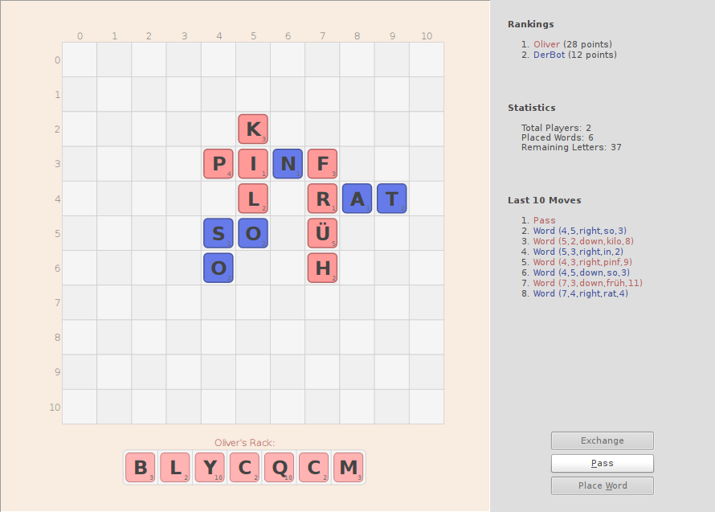

# WordJuggler

WordJuggler is a simple Scrabble implementation featuring an intuitive
drag'n'drop based user interface as well as an autonomous player you
may compete with.



## Requirements

In order to run _WordJuggler_ you have to ensure that you installed the
listed software packages:

* Python >= 3.2
* PyQt4

## Usage

You can change nearly all game related options like board size, player count,
word list, etc. using the command line switches.
Simply run `wj.py --help` to see what options are currently available.

**Beware:** The supplied list of [words] and [letter scores] is made for the
German language. In order to use another language you have to supply adjusted
ones.

### Human vs. Bot (1 Player)

In order to play against a not that smart bot you might run the following
command:

```Shell
$ wj.py human:MaxMaler bot:NotThatSmartBot
```

### Human vs. Human (2 Players)

If you want to play against another human player, which has to use the same
computer though, you migh run this command:

```Shell
$ wj.py human:Player1 human:Player2
```

## License

OMPromises is licensed under the terms of the MIT license.
Please see the [LICENSE] file for full details.

[words]: data/words.csv
[letter scores]: data/letters.csv
[LICENSE]: LICENSE

